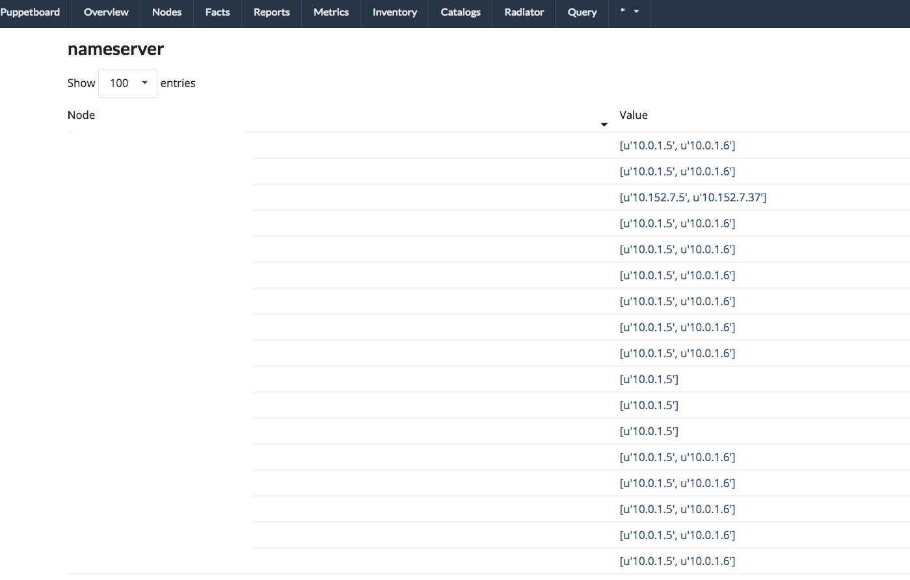

# Day 17 - 什麼軟體盤點？就用 facter 就好啦！

本系列文資料可參考以下：

- [Github](https://github.com/shazi7804/ops-puppet-30-days)
- [Gitbook](https://gitbook.com/book/shazi7804/puppet-manage-guide/details)
- [Mr.沙先生](https://shazi.info)

---

今天要講的是 Puppet 的另一個神器 `facter`，這是內建在 Puppet 裡的一項工具，也是 Puppet 必要的核心工具之一，再談 facter 之前先談談敝公司前陣子才在做 `軟體清單盤點` 這件事 ...

其實我沒有很驚訝或是覺得很可怕，身為一個 21 年的企業每年都要做的盤點事情應該早就有招了吧 !! 然後細問後才發現每一年都是人工去盤出來的 (靠 ...)，很不幸的是我們公司大概有 2000 多台 (應該吧，或不只 ...) ... 

這時想到 Puppet 的 `facter` 其實可以做到這件事情，facter 是 Puppet 用來收集系統資訊使用，除了內建的一些變數以外，你還可以自己寫 facter 或使用外部 facter 來取得你想要的參數，以上面的例子來說就是所有 software version 或是 ... haha !!

## facter command line

先講簡單的 cli 工具，只要你有裝 Puppet agent，那麼你已經有 `facter` 可以用，沒意外會在 `/opt/puppetlabs/bin/facter` 這邊找到 softlink 的 facter。

直接跑 facter 會出現內建的 variable

```shell
$ facter
aio_agent_version => 1.10.1
augeas => {
  version => "1.4.0"
}
dmi => {
  product => {
    name => "MacBookPro13,2"
    ...
```

會看到一堆系統參數，但是要怎樣取得有用的參數 ?，以 IP 為例

```shell
$ facter networking.ip
10.0.0.101
```

或是目前的 OS 訊息。

```shell
$ facter os
{
  architecture => "x86_64",
  family => "Darwin",
  hardware => "x86_64",
  macosx => {
    build => "17C88",
    product => "Mac OS X",
    version => {
      full => "10.13.2",
      major => "10.13",
      minor => "2"
    }
  },
  name => "Darwin",
  release => {
    full => "17.3.0",
    major => "17",
    minor => "3"
  }
}
```

除了這些以外可以直接看 [Core Facts][core-facts] 更多內建 facter

如果你有 `custom facter` 也可以 include dir 用 `--custom-dir` 指定位置，一般會在 `/opt/puppetlabs/puppet/cache/lib/facter/*.rb` 這邊。

或是直接利用 `FACTERLIB` 這個變數來 include custom-dir

```shell
$ export FACTERLIB=/opt/puppetlabs/puppet/cache/lib/facter
```

## 自己寫 facter 來收集資料

除了內建的 facter 以外，還可以自己寫 facter 來抓資料，你可以寫在 [module plugin][puppet-module-plugins] 內。

- `/etc/puppetlabs/code/modules/<module_name>/lib/facter/*.rb`

### 範例

簡單用個範例來取 resolv.conf 裡的 name server。

```
#!/usr/bin/env ruby
# /etc/puppetlabs/code/modules/profile/lib/facter/name_server.rb
Facter.add(:nameserver) do
  setcode do
    # Find all the nameserver values in /etc/resolv.conf
    nameserver_data = Facter::Core::Execution.exec('/bin/cat /etc/resolv.conf | grep nameserver | awk \'{print $2}\'')
    nameserver = nameserver_data.split(" ")
  end
end
```

利用 `Facter.add` 的方式加入新的 facter，這邊是直接用 exec 來跑 shell 取參數，很方便。[更多範例][facter-example]

## 寫了 facter 然後呢 ?

當 facter 成功被 deploy 到 Node 之後，在每次的 deploy，Agent 都會回傳 report 給 Puppet Server，這時如果你有建立 Puppetdb 就會存入 Puppetdb 裡面。

透過 Dashboard 你可以看到被拋回來的資料



或是直接透過 [Puppet API][puppet-api] 來取得。

## 結語

但是當時導入 Puppet 大約只有 300 台左右，所以只好認命用 script 掃了好幾天 ... (悲劇)

[core-facts]: https://puppet.com/docs/facter/3.6/core_facts.html
[puppet-module-plugins]: https://puppet.com/docs/puppet/5.3/plugins_in_modules.html
[facter-example]: https://puppet.com/docs/facter/3.6/fact_overview.html
[puppet-api]: https://puppet.com/docs/puppet/5.3/http_api/http_api_index.html
